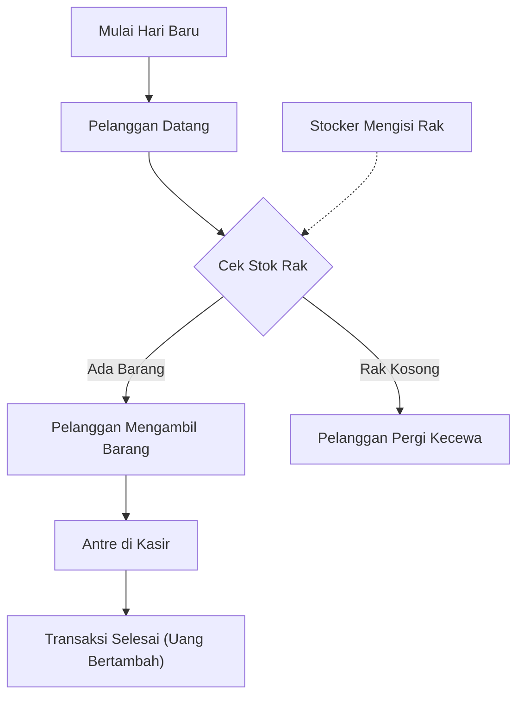

# Siklus Permainan (Core Loop) — SimCH Business

Game ini dirancang dengan struktur siklus permainan (*core loop*) yang terbagi menjadi tiga level jangka waktu: jangka pendek, jangka menengah, dan jangka panjang.

## 1. Siklus Jangka Pendek (Detik ke Menit)
Ini adalah aktivitas operasional dasar yang terjadi secara langsung di dalam toko:
1. **Pelanggan Masuk**: Datang ke toko untuk mencari produk.
2. **Pengisian Rak**: Karyawan (Stocker) memindahkan stok barang dari ruang penyimpanan/gudang ke rak toko yang kosong.
3. **Transaksi Kasir**: Pelanggan mengantre di kasir, melakukan pembayaran, dan menghasilkan uang kas langsung untuk pemain.
4. **Kehilangan Peluang**: Jika rak kosong atau antrean kasir terlalu panjang, pelanggan pergi tanpa membeli (kehilangan pendapatan potensial).

---

## 2. Siklus Jangka Menengah (Menit ke Jam / Harian)
Ini adalah siklus manajemen taktis harian untuk menjaga agar operasional jangka pendek tetap berjalan:
1. **Membeli Pasokan (Restock)**: Memesan barang secara grosir untuk mengisi kembali gudang penyimpanan sebelum kehabisan stok.
2. **Manajemen Keuangan**: Membayar biaya operasional harian (sewa gedung, utilitas listrik, dan gaji karyawan).
3. **Analisis Pasar & Harga**: Memantau tingkat penjualan setiap produk dan menyesuaikan harga jual eceran untuk memaksimalkan keuntungan bersih.

---

## 3. Siklus Jangka Panjang (Sesi Bermain / Mingguan)
Ini adalah tujuan akhir dari permainan, yaitu pertumbuhan dan ekspansi bisnis:
1. **Akumulasi Laba**: Mengumpulkan keuntungan bersih setelah dikurangi semua pengeluaran operasional.
2. **Investasi & Ekspansi**:
   * Membuka jenis bisnis baru (misal: dari toko kelontong naik kelas ke toko elektronik).
   * Membeli properti atau menyewa gedung yang lebih luas.
   * Meningkatkan sistem logistik (membeli truk pengiriman yang lebih cepat/kapasitas besar).
3. **Meningkatkan Nilai Bisnis**: Mencapai target performa finansial untuk menyelesaikan skenario permainan atau mencapai rekor skor baru.
