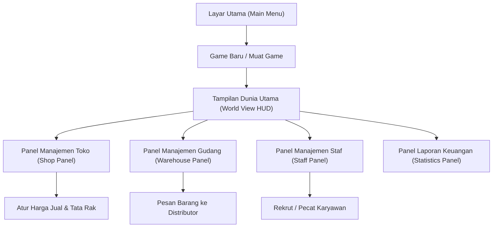

# Alur Antarmuka & Navigasi (UI Flow) — SimCH Business

Dokumen ini menjelaskan struktur menu, panel HUD, dan transisi layar dalam game.

## 1. Diagram Alur Antarmuka (UI Flowchart)

---

## 2. Struktur HUD Utama (World View HUD)
HUD selalu terlihat di bagian atas layar saat permainan berlangsung:
* **Bagian Kiri (Informasi Waktu)**:
  * Jam & Hari (misal: "Hari 3, 08:30").
  * Kontrol Kecepatan Waktu: Pause ($II$), Normal Speed ($\blacktriangleright$), Fast Forward ($\blacktriangleright\blacktriangleright$).
* **Bagian Tengah (Keuangan)**:
  * Saldo Uang Kas pemain saat ini (misal: "$25,430").
  * Tren Keuntungan Harian (hijau jika profit, merah jika rugi).
* **Bagian Kanan (Tombol Panel)**:
  * Tombol untuk membuka menu Manajemen Toko, Gudang, Karyawan, Statistik, dan Pengaturan Game.

---

## 3. Detail Panel Manajemen

### A. Panel Manajemen Toko
* Menampilkan daftar rak yang ada di toko ritel.
* Menampilkan produk apa yang dipajang di masing-masing rak beserta jumlah stoknya.
* Slider untuk mengubah harga jual eceran produk.

### B. Panel Gudang
* Menampilkan kapasitas gudang (terisi vs total kapasitas).
* Katalog distributor: Daftar produk yang bisa dibeli per box (beserta harga grosirnya).
* Tombol "Beli" untuk memesan barang langsung ke gudang.

### C. Panel Staf
* Menampilkan daftar karyawan aktif beserta status mereka (Peran, Gaji, Energi).
* Tombol untuk merekrut karyawan baru dari bursa tenaga kerja atau memecat staf aktif.

### D. Panel Statistik
* Grafik garis sederhana yang menunjukkan tren Pendapatan vs Pengeluaran dalam 7 hari terakhir.
* Rincian laporan keuangan hari sebelumnya.
